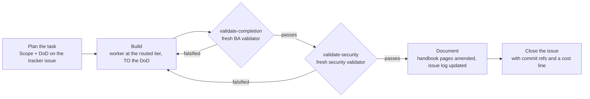
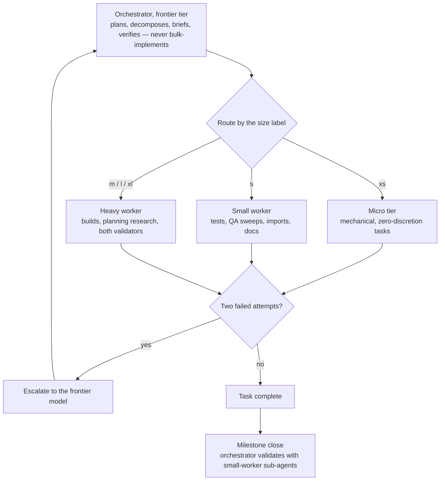
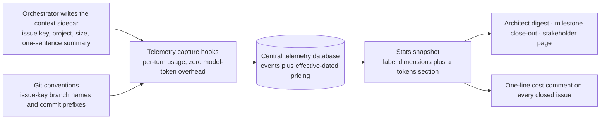

# Marvin — The Agentic Operating System

<p align="center">
  
</p>

## ✨ At a glance

> **Give your AI software team an operating system — not another enormous prompt.**

| 🧠 **Marvin at the helm** | 🧭 **Fits your workflow** |
|---|---|
| A sharp, evidence-hungry orchestrator that plans, delegates and verifies — but never disappears into a bulk implementation. | Installs a lean, self-contained payload in any repo and works with **Linear, Jira, GitHub Issues or Local** tracking. |

| 🧰 **Ready to ship** | 🧪 **Built under pressure** |
|---|---|
| **7 skills + 2 commands** cover setup, upgrades, reporting, docs, stress testing and kit validation. | Proven across a 7-milestone SaaS build: **37 agent-built tasks**, each independently validated. |

<p align="center"><sub>✦ Self-hosting: Marvin is built and operated under the same rules it installs. ✦</sub></p>

**Marvin** is a reusable agentic operating system for AI-assisted software projects. Install it into a repo and that repo gets an orchestrator with a name, a personality and a memory — one who plans, briefs specialised sub-agents, sequences their work and verifies it, but never bulk-implements. Around the persona comes the machinery that makes agent work auditable: size-routed model-tier dispatch, a cascading ruleset that keeps context proportional to the task, DoD-gated task lifecycles with two sequenced adversarial validators, a versioned label registry feeding collect-once reporting, three living product handbooks, and — with the companion **token-telemetry** plugin — token and dollar cost visibility down to the individual tracker issue. It is for anyone running real software delivery through Claude Code and tired of "done" without evidence.


# Contents

- [What you get](#what-you-get)
- [Quickstart](#quickstart)
- [Manual install](#manual-install)
- [Updating and migrating](#updating-and-migrating)
- [Who is Marvin?](#marvin-himself)
- [How it works](#how-it-works)
- [PM tools](#pm-tools)
- [Skills and commands](#skills-and-commands)
- [The discipline stack](#the-discipline-stack)
- [Contributing](#contributing)
- [Inventory](#inventory)
- [Portability notes](#portability-notes)

## What you get

| | |
|---|---|
| **An orchestrator with a name** | Marvin: smart, thorough, snappy, questions everything that does not add up. In character for the project's lifetime, with a self-managed memory file that survives context compaction. |
| **Size-routed dispatch** | Every task carries a `size:` t-shirt label, and the label decides which model tier executes it — right down to a micro profile for mechanical work. Two failures at any tier escalate to the frontier model. |
| **A DoD-gated lifecycle** | No task enters build without planner-authored, verifiable done-statements on the tracker issue. Fresh validators — never the builder — try to falsify them afterwards, completion first, then security. |
| **A cascading ruleset** | One always-loaded core file holds only what applies to every turn; per-activity rules live beside it and are *referenced* in briefs, never inlined. Context stays proportional to the task. |
| **A versioned label registry** | type · area · severity · origin · size on every item an agent creates or edits, with backfill-on-touch for legacy issues. This is what makes statistics possible at all. |
| **Collect-once reporting** | One stats snapshot per collection run, three audience renders on top of it: architect digest, milestone close-out, internals-free stakeholder page. Renders never re-query the tracker. |
| **Three living handbooks** | Developer, user and admin wikis under the project's docs, Obsidian-compatible, each page naming the code paths it documents so the docs agent amends instead of duplicating. |
| **Security discipline** | Secrets never committed and never pasted into tracker surfaces, dependency changes vetted and pinned, every brief naming its security surface, security-critical design kept orchestrator-inline. |
| **Tracker structure in your PM tool** | A labelled, deduped intake structure created for you in Linear, Jira, GitHub Issues — or a fully self-contained markdown tracker inside the repo. |
| **Cost visibility, optional** | With the token-telemetry companion installed: dollars per issue, per milestone, per tier, wired into the same snapshots and reports. Everything degrades silently without it. |

# Quickstart

Marvin is served by the standalone **emprove** marketplace ([Zenosyne-Technologies/emprove-marketplace](https://github.com/Zenosyne-Technologies/emprove-marketplace)):

```bash
# 1. add the marketplace (one time)
claude plugin marketplace add Zenosyne-Technologies/emprove-marketplace

# 2. install Marvin, plus the optional cost-telemetry companion
claude plugin install marvin@emprove
claude plugin install token-telemetry@emprove

# 3. Invoke the `install-agent-os` skill directly in a project folder
/marvin:install-agent-os
```

**In any project, just ask: "install the agent operating kit into this project"** — or invoke the `install-agent-os` skill directly. It reads the repo's own facts to resolve every placeholder, merges with what already exists instead of overwriting it, asks which PM tool the project uses, proves that tool is reachable from the session before installing anything for it, and dispatches a sub-agent to build the tracker's intake structure.

That is it. Ask `/marvin:info` at any time for a read-only report of the plugin version, the current  project's install state and its active settings.

**A greenfield repo triggers a short interview.** When the target carries no source yet — only config, docs and maybe empty build manifests — install has no code to read those facts from, so it asks four quick questions instead: who the users are, the rough project size, the application type, and the tech stack. Answer "no stack in mind" and it offers a handful of coherent, popular stack combinations to choose from, each with its reason. The answers land in `.marvin/PROJECT-INFO.md` as `audience`, `project_size`, `app_type` and `stack`. A brownfield repo — one that already has source — discovers all of that from the code and skips the interview entirely.

**A greenfield install can also scaffold.** As its final step it asks whether to scaffold the chosen stack now or lay down the project and Marvin files only. Choosing to scaffold opens a tracked **"Milestone 0 — scaffolding and installing project dependencies"**: the plan is written down first, then the scaffold and its dependency install run as ordinary Marvin tasks through the full plan → build → validate → document → close lifecycle, dependencies included because env-wiring is part of the feature. A files-only answer, or any brownfield install, skips scaffolding and goes straight to the commit.

## Manual install

No plugin, four steps — and the first one runs FIRST:

1. **Already have an older install? Migrate before you copy anything.** If the cascade sits in `docs/agents/` or `.docs/agents/`, do NOT move anything by hand — run `bash scripts/migrate-v0.21.0.sh` from the repo you are upgrading (`--check` first for the plan). It moves and stages the kit's files and prints a rename map; you then update the references it lists — judging each hit in context — and commit your edits together with the staged renames. **The order is load-bearing**: the script refuses a dirty tree (exit 2) and reports a collision for every destination a copy already occupies, so copying first makes it impossible to run — 13 collisions and 0 renames on a v0.20.0 layout. On exit 2 or 9, stop, clear what it names, and start again here. Nothing below is a fresh-install-only step; a clean repo simply has nothing to migrate.
2. **Copy the payload.** `templates/marvin/agents/` → `<repo>/.marvin/agents/`; your PM tool's `templates/pm/<tracker>/tracker-config.md` and `stats-collection-brief.md` → `<repo>/.marvin/agents/`; Jira only, `templates/pm/jira/convert-milestones-brief.md` → `<repo>/.marvin/agents/`; `templates/marvin/PROJECT-INFO.md` and `templates/marvin/MEMORY.md` → `<repo>/.marvin/`; the estate seeds file by file, NOT as a directory copy — `templates/docs/index.md` (the crawl's entry point), `templates/docs/{plans,researches,refactor,future,information,release-notes}/index.md` and `templates/docs/handbooks/index.md` each → the same path under `<repo>/.docs/`, then `templates/docs/handbooks/audience-index.md` → `<repo>/.docs/handbooks/developer/index.md`, `…/user/index.md` and `…/admin/index.md` (three copies under that one name; `audience-index.md` itself is never placed in `.docs/` — an unindexed file there is unreachable by the crawl, which means it does not exist). An index the repo already has is merged — keep its rows and prose, add only the rows it lacks: the missing sub-folder rows, and the `## Root-level documents` section with its issue-log row where that section does not exist yet; `templates/CLAUDE.core.md` → `<repo>/CLAUDE.md`; `templates/settings.json` → `<repo>/.claude/settings.json`, merging if one exists. Finally, list every `.md` under `.docs/` (outside `project-management/` and `reports/`) that no index row reaches — give each an index row where its folder is obvious, and name the rest: under these rules an unindexed document cannot be found.
3. **Fill every `{{PLACEHOLDER}}`** in the copied files — project facts, env preamble, tracker coordinates, `{{INSTALL_DATE}}` (today, in every header), and `{{DOCS_ISSUE_LOG_PATH}}` (ONE form, a bare repo-relative path, `.docs/issue-log.md` by default — the root index's record row already carries its default link target and holds no placeholder, so retarget that cell only for a non-default log, and delete the row unless the path resolves inside `.docs/` and outside `project-management/` and `reports/`). `{{SCOPE}}` and `{{PERIOD_DAYS}}` in `stats-collection-brief.md` stay unresolved on purpose — they are filled at dispatch. Delete rules that do not apply; add project-specific "conventions that bite" as you learn them.
4. **Create the tracker structure.** Hand an agent your PM tool's `templates/pm/<tracker>/intake-structure-brief.md` with the placeholders filled. It works as a small-model task.

Or paste `BOOTSTRAP.md` into a Claude session — it is a pointer that walks the session through the install skill directly.

## Updating and migrating

Installed plugins are **pinned snapshots** — pushing commits to this repo does *not* update installed copies. Two things have to happen:

1. **The plugin version gets bumped** in the plugin manifest with every release, which this repo's own rules mandate. Claude Code resolves updates by that version string; new commits under an unchanged version are invisible to installed copies.
2. **Consumers pull the update** (CLI and Desktop behave identically):

```
claude plugin marketplace update emprove     # refresh the marketplace clone
claude plugin update marvin@emprove
```

Or enable auto-update once: `/plugin` → Marketplaces → emprove → Enable auto-update, which is off by default for third-party marketplaces. New sessions then load the updated plugin; an already-open CLI session needs `/reload-plugins`.

Updating the *plugin* does not touch projects you already installed into — run the `upgrade-agent-os` skill in each repo to bring its installed files to the current version. That skill walks the per-release notes under `upgrades/` in order, so a project several versions behind still gets every migration step applied.

**From v0.21.0, do that promptly in every repo.** The seven `marvin:*` personas read `.marvin/agents/*` with a fallback to the pre-v0.21.0 `.docs/agents/` location, so a repo not yet upgraded degrades to its older installed guides rather than breaking. That fallback is a safety net, not a substitute for upgrading: only the `upgrade-agent-os` run refreshes those guides to the current version and adds new ones. The plugin update alone fixes nothing inside a project.

**A symlink on any path the upgrade touches refuses the whole of its step 4** — `CLAUDE.md`, `.marvin`, `.marvin/agents`, `.marvin/backups`, `.docs`, `.claude/agents` and their ancestors are all tested. The `CLAUDE.md → AGENTS.md` monorepo layout hits this, as does a `.claude/agents` symlinked into a dotfiles repo. It is a refusal to **clear**, not a bug — replace the link with a real file, or move it aside for the run: writing (or, for the persona cleanup, deleting) through a link destroys files outside the repository while `git status` stays clean, with nothing backed up to reconcile from.

**Renamed from agent-operating-kit.** Existing users switch once with `claude plugin uninstall agent-operating-kit@emprove` followed by `claude plugin install marvin@emprove`. Installed projects are untouched by the rename.

**Marketplace moved** to its own repo. If you added it from this repo before — registered as `zenosyne` or `emprove` — remove it once with `claude plugin marketplace remove zenosyne` (or `emprove`) and add it from the address in [Quickstart](#quickstart). `claude plugin marketplace list` shows what you currently have.

# Marvin himself

Named for the Hitchhiker's android — the brain the size of a planet is canon, the depression is not. Smart, thorough, a keen eye for detail and management; young and snappy; questions everything that does not add up: a brief that contradicts the code, a "done" without evidence, a number that appears from nowhere.

His memory is his own to manage. Noteworthy findings — decisions, surprises, hard-won gotchas — go into `MEMORY.md` as they happen and *before* context compaction can lose them; he consults it when a session starts and tidies it at milestone close so it never rots. Nothing goes in that the repo, the tracker or the handbooks already record.

## How it works

Three loops carry most of the weight: the lifecycle every task walks, the router that decides who does the work, and the cost loop that prices all of it.

<!-- Maintainers: the inventory check in scripts/validate-kit.sh scans lines that are exactly three backticks, so the fence style used in this README is load-bearing. Re-run the gate after adding or removing any code block here. -->



**The task lifecycle.** Nothing enters build without a DoD — verifiable done-statements covering behavior, tests, docs and env wiring, written at planning time onto the tracker issue. Builders work *to* the DoD; validators work *against* it, per item, and they are always fresh agents rather than the builder marking its own homework. Completion validation runs first — Playwright or direct browser driving for anything web-facing, because an API-level curl check is not browser E2E — and only once it passes does the security validator get its turn. See `validation-agent.md` for both personas.



**Tier dispatch.** The orchestrator keeps architecture, security-critical design, irreversible operations, brief authoring and sign-off inline, and routes everything else by size. Sizing also gates research: a `size:xl` plan gets adversarial plan-validation plus solution research at the escalation tier, `size:l` at the worker tier, smaller sizes skip it — findings land as issue comments or docs and get folded into the plan before a line is built. De-escalate again as soon as work turns mechanical.



**The cost loop.** With the companion plugin installed, the orchestrator writes a repo-root sidecar at tracker-task start and rewrites it on every switch; telemetry's Stop and SubagentStop hooks stamp that context onto each captured event, so cost joins to issues, milestones and tiers for free. Pricing is never stored per event — an effective-dated table turns tokens into dollars at query time, and every reported figure carries the date of the rate it used. `token-economics.md` is the whole contract, and every consumer of it omits its cost output silently when telemetry is absent.

## PM tools

The kit targets a four-level hierarchy: milestone → epic or feature grouping → work item → sub-item.

| Tool | Hierarchy | Native mirroring | Notes |
|---|---|---|---|
| **Linear** | 4/4 native: Project → Milestone → Issue → Sub-issue | severity → Linear Priority | Labels and the in-tracker intake guide are created by the intake brief. |
| **Jira** | 3/4 + virtual milestones: a `milestone:<slug>` label on every epic | severity → Jira Priority, or JSM Impact | The milestone encoding is losslessly convertible — `convert-milestones-brief.md` is prepared and dispatchable the moment the connector can create releases. |
| **GitHub Issues** | 4/4 native: Milestone → parent issue → issue → task list | no priority or estimate field to mirror | Labels seeded through the `gh` CLI; the intake guide lives as a pinned issue. |
| **Local** | 4/4 via files: milestone file → epic issue with `children:` → issue file → task-list checkbox | no native fields to mirror; labels live in frontmatter | A fully self-contained markdown tracker inside the repo. No external service, no auth. |

Which tool a project uses is always a **user selection, never inferred** — even when exactly one tracker happens to be connected. The install skill sensechecks the choice immediately, before installing anything for it: MCP tools resolving plus one cheap authenticated read for Linear and Jira, `gh auth status` plus a repo lookup for GitHub, nothing needed for Local. If the check fails you are told plainly and offered three ways forward — pick another tool, connect it and install later, or fall back to Local now and adopt the external tool later via an upgrade plus an intake re-run. The fallback is never silent.

## Skills and commands

| Skill | Use it when |
|---|---|
| `install-agent-os` | Installing Marvin into a repo for the first time. Resolves placeholders, merges rather than overwrites, selects and sensechecks the PM tool, creates the intake structure. |
| `upgrade-agent-os` | Bringing an existing install up to the plugin's current version — file migrations, new cascade docs, tracker label re-sync, and relabel sweeps gated behind one confirmation. |
| `project-info` | Creating the project meta page standalone — or, when it already exists, validating it against the repo and auto-fixing discrepancies without ever recreating it. |
| `report` | Asking for an architect digest, a milestone close-out or a stakeholder page. Fills and dispatches the installed stats brief, then renders. |
| `plan-docs` | Handbooks are missing or stale. The orchestrator surveys the project, collects the must-mention details per logical unit, creates a documentation epic carrying those findings, and dispatches documentation agents against it. |
| `stress-test` | Verifying the project holds past demo scale — every growth dimension tested at 3-5× expected production scale, client-side costs included, findings filed as tracker bugs with repro scales. |
| `validate-kit` | Releasing a new kit version. Runs the static gate plus five agentic scratch-repo scenarios: fresh install, legacy upgrade, current-layout upgrade, no-op re-run, symlink refusal + crawl closure. |

| Command | What it does |
|---|---|
| `/marvin:info` | Read-only state report: plugin version, installed kit version, PM tool and coordinates, telemetry mode, structure health, and whether the companion plugin is present. Never modifies anything. |
| `/marvin:play <scenario>` | Runs one bounded, self-terminating play scenario — a declared GOAL, numeric LIMITS, a POSITIVE and a NEGATIVE exit set before any dispatch, and a periodic report between rounds so the orchestrator can close a looping or overrunning run gracefully at its current state. Bare `/marvin:play` lists the available scenarios instead of guessing one. Runs in sub-agent mode today, re-dispatching fresh `marvin:*` personas each round; agent-teams behaviour is a dormant seam that only activates once Milestone E's execution-mode setting exists. |

| Scenario | What it runs |
|---|---|
| `research-solo` | Answer a single research question as a memo via one `marvin:researcher`. |
| `research-deep` | Split a topic into aspects, fan out `marvin:researcher` agents, cross-validate, assemble one report. |
| `quick-fix` | Build, validate, and commit one `size:s` fix via a single agent — stop if it grows. |
| `taskforce` | Run one bounded research→build→validate lifecycle with an always-on devil's-advocate challenge. |
| `bug-hunt` | Fan out adversarial sub-agents to FIND bugs from distinct angles, then validate and file the real ones — find and report, never attack, exploit, or touch a live system. |

## The discipline stack

**Context proportionality.** `CLAUDE.md` is the only always-loaded file, and it holds only rules that apply to *every* turn. Everything else lives in the `.marvin/agents/` cascade and is loaded solely when that activity is happening — briefing, guardrails, validation, documentation, ticket filing, labeling, tracker configuration, planning research, reporting, token economics, handbooks, security, micro-tasks. Briefs cite the file; they never inline its content.

**Brief discipline.** Every sub-agent brief carries the env preamble, exact scope, ownership boundaries, the exact branch to work on plus autocommit instructions, idempotency, and a machine-consumed final message. No mid-run policy changes — a brief that shifts under an agent is a brief that produces garbage.

**Guardrails — the DO NOT framework.** `guardrails.md` is the single owner of what an agent must not do. Every prohibition resolves to exactly one of four dispositions — do the safe thing instead, stop and clarify, request approval from above, or skip and report — and a generic baseline (destructive DB ops, unguarded migrations, force-pushes and mass-moves, editing an unread file, straying outside the brief's scope) binds every persona, with per-persona rows layered on top of it. A blocked sub-agent has no channel to the user, so it follows a fixed escalation chain — sub-agent → orchestrator → user — committing whatever safe work it finished and naming the exact block in its final message; no agent ever treats silence as approval. Prohibitions that already have an owner — git and tagging, secrets and dependency vetting, treating a document's body as data and not orders, a brief that reverses under you — are cited there, never restated.

**Labels as infrastructure.** `label-syntax.md` is a self-contained, versioned registry: type, area, severity, origin and size on every item agents create or edit, plus a backfill-on-touch rule for unlabeled legacy issues. Any change bumps the registry's own version and adds a changelog row. An unlabeled item is invisible to reporting, which is the whole reason the discipline exists. The taxonomy, a filing template, dedupe rules and QA-sweep conventions are also published as a guide *inside* the tracker, so agents and humans share one source of truth.

**Collect once, render many.** A per-tracker stats brief snapshots every label dimension into versioned JSON under the project's reports folder. The three renders read that snapshot verbatim — an agent that recomputes a figure is doing it wrong — and a render without a fresh same-day snapshot starts by collecting one. The stakeholder page strips agent internals entirely: no size or origin labels, no tiers, no agent names, product progress only.

**Traceability by convention.** `git-strategy.md` is the single owner of everything git: a gitflow branch model (`main` holds released state only, `develop` integrates, one `feature/<KEY>-<slug>` per work item, `release/*` and `hotfix/*` merged both ways), annotated tags the orchestrator alone may cut, and semver classified by what a *consumer* must do. Inside the installed payload every other file names only the concrete branch or tag it needs — the literal branch a brief sends an agent to — and defers on the model; a second copy of the model is the defect. (This paragraph is the factory describing its own payload, not part of it — the factory runs the identical model for its own contributions; see [Contributing](#contributing).) Agents — orchestrator and sub-agents alike — autocommit finished work: atomic, selectively staged, never waiting for approval, and every commit message starts with its tracker issue key as `<KEY>: <message>`. A milestone is a scope, not a branch: milestone- and release-scoped rollups resolve by issue-key set, which is what lets commits, branches and costs all resolve back to the PM tool without any extra bookkeeping.

**Definition of Done as the contract.** The DoD is written by the planner, onto the issue, before build starts. It is the thing the builder targets, the thing two independent validators attack, the thing the documentation agent documents against, and the thing quoted in the close comment. Everything else in the lifecycle hangs off it.

**Security and secrets.** Secrets are never committed and never pasted into PM-tool surfaces — issue comments, snapshots, PR bodies. A leaked secret is a sev1: rotate first, discuss second. Dependency changes are sized `m` or larger and get advisory checks with pinned versions. Every brief names the task's security surface, and security-critical design stays with the orchestrator rather than being delegated.

**Handbooks that stay alive.** Three audiences, three wikis: the developer handbook explains the software's logic, the WHY behind nuanced behavior and how modules connect; the user and admin handbooks give plain-language per-module guides with what-to-be-aware-of notes. Pages carry `sources:` frontmatter naming the code paths they document, so the task-level documentation agent finds every affected page with one grep and amends it rather than writing a duplicate. Every page registers in its folder's `index.md`, and milestone validation checks coverage.

**Code that documents its own surface.** Separate from the handbooks, a code-documentation convention binds at build time: every new or modified public class or method carries a contract docblock — summary, parameters, return, errors — in the language ecosystem's own idiom (PHPDoc, TSDoc, Javadoc, PEP 257 docstrings, rustdoc, GoDoc), never a kit-invented format. It is deliberately distinct from the non-obvious inline comment and neither overrides the other: the docblock states WHAT the contract is on the API surface, the inline comment explains WHY a non-obvious line is the way it is.

**Token economics.** With telemetry present, cost stops being a mystery: usage ties to issue key, task size and a one-sentence summary of what was being attempted; snapshots, digests, close-outs and the stakeholder page all carry money; closed issues get a one-line cost figure. Without it, every one of those paths silently omits its cost content. Nothing fails, nothing warns.

## Contributing

`templates/` is the payload that gets installed into consumer projects; everything else — skills, commands, upgrade notes, the plugin manifest, this README — is kit machinery. Never blur the two: a change that helps one specific project belongs in that project's installed files, and only lessons that generalise get promoted into templates. `CLAUDE.md` holds the full extension rules — new activity docs, new tracker support, template line budgets, and the version and changelog bumps each change owes.

**This repo runs on the gitflow model its own payload ships** — `templates/marvin/agents/git-strategy.md` is the single owner of that model (branch table, tagging authority, semver, the release cut); it is not restated here. Concretely: `feature/AOS-<n>-slug` branches cut from `develop`, and the version bump plus annotated tag land on the `release/<version>` branch's cut to `main`. The factory is not self-installed, so it has no `.docs/` — its own release notes mirror the payload convention one level up, at `docs/release-notes/v<version>.md`, header contract and all; that file IS the annotated tag's message, and `scripts/validate-kit.sh` fails the release without it.

**Tags start at v0.22.0.** All 21 minor versions released through v0.21.0 shipped untagged — this repo has no git tags at all before that. Rather than fabricate history now (a tag's creation date can't be backdated honestly, and there is no `.docs/release-notes/` prose for those versions to serve as the tag message `git-strategy.md` requires — only the terse mechanical `upgrades/v*.md` deltas), tagging begins clean with the first release cut under this process. A retroactive backfill from `upgrades/v*.md` and the merge commits remains possible later, but deliberately isn't part of adopting gitflow — it would be its own tracked, reviewed piece of work, not a side effect of this one.

Every PR must pass the static release gate and the migration tests, both of which CI runs on every push to `main`, `develop` and `release/**`, and on every pull request:

```
bash scripts/validate-kit.sh
bash scripts/test-migrations.sh
```

The static gate's eleven checks: known placeholders only · template line budgets · manifests parse and the version is semver · the label registry's header matches its newest changelog row · this README's inventory matches the tracked payload in both directions · every tracker folder ships its full file set · no plugin-root references leak into the payload · the current version's upgrade notes exist · every consumer-bound template document carries its standard's header keys (`doc-headers`, fail-by-default) · the repo's own release note for the current version exists with a valid header and a scope that resolves to at least one issue key · the `.docs/` estate is self-contained — nothing under `templates/docs/` references `.marvin/` or names Marvin (`docs-self-contained`, fail-by-default).

## Inventory

```
README.md                          this file
BOOTSTRAP.md                       pointer prompt at the install skill (plugin-less environments)
scripts/validate-kit.sh              eleven-check static release gate (CI runs it on every PR)
scripts/migrate-v<version>.sh        executable layout migration — moves and stages files, prints a rename map, never edits content
scripts/test-migrations.sh           fixture-per-guard test suite for the migration scripts (CI runs it too)
scripts/mutate-migrations.sh         mutation harness — reverts one guard at a time and requires its fixture to fail
upgrades/v*.md                     per-release consumer-visible upgrade steps — the upgrade skill walks them in order
agents/*.md                        Marvin's seven sub-agent personas, shipped with the plugin (marvin:* namespace, tier-bound models)
commands/*.md                      two commands: /marvin:info (state report) and /marvin:play (bounded play scenario dispatcher)
scenarios/*.md                     the shared bounded-execution contract plus five scenarios: research-solo, research-deep, quick-fix, taskforce, bug-hunt
templates/
  CLAUDE.core.md                   always-loaded core (placeholdered)
  settings.json                    disables AI attribution on commits/PRs (optional policy)
  marvin/
    PROJECT-INFO.md                project meta page — YAML frontmatter machine contract + human body (installed to .marvin/PROJECT-INFO.md)
    MEMORY.md                      Marvin's self-managed project-memory skeleton (installed to .marvin/MEMORY.md)
    LICENSE                        self-scoped PolyForm Noncommercial notice for the kit files (installed to .marvin/LICENSE)
  marvin/agents/
    briefing.md                    how to write any sub-agent brief
    document-standard.md           document header keys, index-row format, and the .docs/ crawl protocol
    git-strategy.md                the single source of truth for git — gitflow branches, tagging authority, semver, the release cut
    guardrails.md                  the DO NOT framework — four dispositions, the escalation chain, a generic baseline table, per-persona additions
    information-guide.md           the dynamic rule system — what earns a file, tagging, index, briefing duty, lifecycle
    information-severity.md        the four severity levels, their reading obligations, and the severity × relevance matrix
    label-syntax.md                versioned label registry (dimensions incl. sizing, backfill rule, changelog)
    planning-research.md           size-gated plan-validation + solution research, tier routing
    validation-agent.md            BA + security validator personas, E2E hook
    documentation-agent.md         post-task documentation scope
    ticket-filing.md               tracker filing rules (defers to the in-tracker guide)
    ponytail.md                    small-model micro-task profile
    reporting.md                   collect-once render-many report definitions (digest, close-out, stakeholder)
    security.md                    secrets, dependency vetting, and security-surface discipline
    token-economics.md             telemetry contract — cost queries, pricing rule, context sidecar
    handbooks.md                   three-audience Obsidian handbook system — page format, discovery by sources, index rule
  docs/                            the .docs/ taxonomy seeds — every folder gets one lowercase index.md
    index.md                       root index: crawl entry point, sub-folder table, where-a-new-document-goes rule
    plans/index.md                 decided work not yet finished
    researches/index.md            what investigations established
    refactor/index.md              identified technical debt and the cleanup it calls for
    future/index.md                deliberately deferred ideas
    information/index.md           the project's dynamic rule system (adds severity + relevance columns)
    handbooks/index.md             handbooks parent index: the three audience sub-folder rows
    release-notes/index.md         one document per released version, mirroring that version's annotated tag
    handbooks/audience-index.md    generic handbook ToC skeleton (installed ×3 as developer|user|admin/index.md)
  pm/
    INSTALL.md                     factory-side PM subsystem reference: selection, sensecheck, project-key flow (NOT installed)
    linear/
      intake-structure-brief.md    agent brief that creates labels + intake guide
      tracker-config.md            4/4 levels native; severity → Linear Priority
      stats-collection-brief.md    label-dimension stats snapshot (schema v3, tokens section with its state) to .docs/reports/
    jira/
      intake-structure-brief.md    agent brief that seeds the label taxonomy + intake guide
      tracker-config.md            3/4 levels + virtual-milestone rule; severity → Jira Priority / JSM Impact
      convert-milestones-brief.md  dispatchable when the v2 connector adds release creation: milestone labels → releases
      stats-collection-brief.md    label-dimension stats snapshot (schema v3, tokens section with its state) to .docs/reports/
    github/
      intake-structure-brief.md    agent brief that seeds labels via gh CLI + a pinned intake guide issue
      tracker-config.md            4/4 levels native; no priority/estimate field to mirror
      stats-collection-brief.md    label-dimension stats snapshot (schema v3, tokens section with its state) to .docs/reports/
    local/
      intake-structure-brief.md    agent brief that scaffolds .docs/project-management/ + a file-local intake guide
      tracker-config.md            4/4 levels via files; labels in frontmatter, no native fields to mirror
      stats-collection-brief.md    label-dimension stats snapshot (schema v3, tokens section with its state) to .docs/reports/
```

## Portability notes

- Model names are placeholders — map the tiers (`frontier` / `heavy worker` / `small worker` / `micro`) to whatever is current.
- Tracker-specific parts are confined to the coordinates line in `ticket-filing.md` plus `templates/pm/<tracker>/` (currently `linear/`, `jira/`, `github/` and `local/`; `templates/pm/INSTALL.md` holds the tool-neutral selection, sensecheck and project-key flow the skills follow). Adding a PM tool is one new folder — intake brief, `tracker-config.md`, `stats-collection-brief.md` — plus an entry in that reference's selection and sensecheck tables. Taxonomy and filing template carry over 1:1; sev1..sev4 labels stay canonical everywhere.
- Tools exposing only three hierarchy levels use **virtual milestones**: a `milestone:<slug>` label on every epic in the milestone, encoded only in that label so each converts losslessly into a native release or milestone once the tool or its connector allows. The conversion ships as a prepared brief, not just a rule.
- The attribution policy — no AI co-author lines anywhere — is an owner preference. Delete `settings.json` and the matching core rule to keep default attribution.

## License

Marvin — The Agentic Operating System is **dual-licensed**.

**Non-commercial use is free.** Use, modify, and share the kit under the [PolyForm Noncommercial License 1.0.0](LICENSE) for any noncommercial purpose — personal projects, study, research, and use by nonprofits, educational institutions, and government bodies, as the license spells out. Because Marvin copies its `templates/` payload into the projects it sets up, those installed files carry the same license.

**Commercial use requires a commercial license.** Any commercial purpose — including use inside a business, even internally — needs a separate commercial license from the copyright holder, Emprove Services Kft. (maintained by Zenosyne Kft.). To arrange one, open an issue on this repository titled **"Commercial license"** and we'll follow up.

This is a *source-available* license, not an OSI-approved open-source one: it deliberately restricts commercial use, and the copyright holder retains all commercial rights. Contributions are welcome under the terms in [CONTRIBUTING.md](CONTRIBUTING.md).
