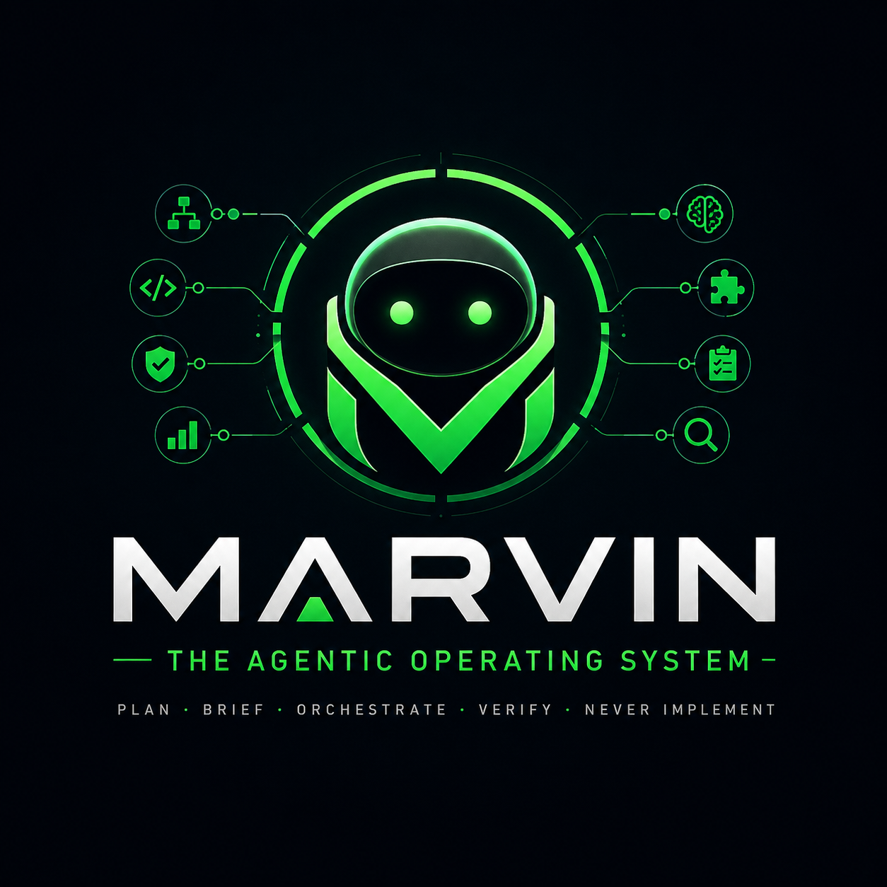
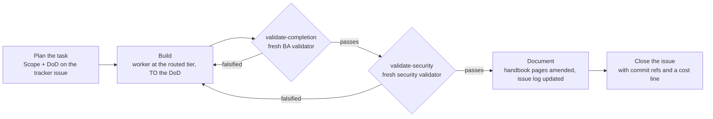
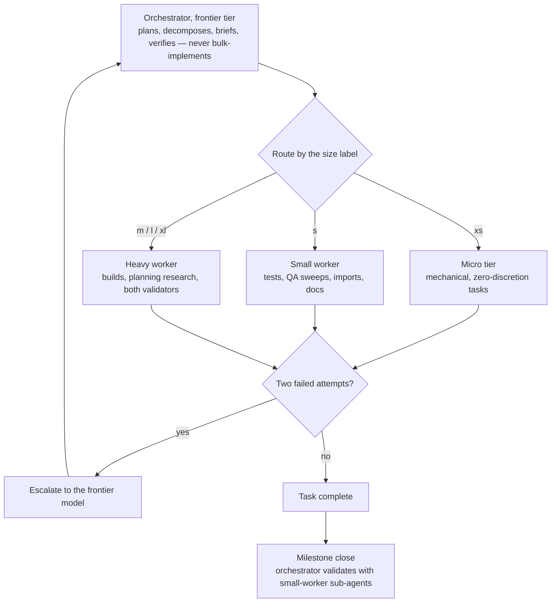
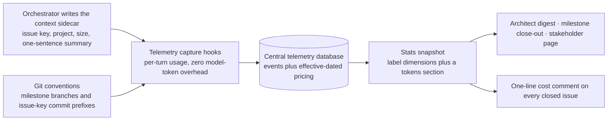

# Marvin — The Agentic Operating System

<p align="center">
  
</p>

**Marvin** is a reusable agentic operating system for AI-assisted software projects. Install it into a repo and that repo gets an orchestrator with a name, a personality and a memory — one who plans, briefs specialised sub-agents, sequences their work and verifies it, but never bulk-implements. Around the persona comes the machinery that makes agent work auditable: size-routed model-tier dispatch, a cascading ruleset that keeps context proportional to the task, DoD-gated task lifecycles with two sequenced adversarial validators, a versioned label registry feeding collect-once reporting, three living product handbooks, and — with the companion **token-telemetry** plugin — token and dollar cost visibility down to the individual tracker issue. It is for anyone running real software delivery through Claude Code and tired of "done" without evidence.

**At a glance** — a Claude Code plugin · four supported PM tools · seven skills and one command · installs a lean, self-contained payload into any repo · battle-tested on a full 7-milestone SaaS build with 37 agent-built, independently validated tasks · self-hosting: this kit is built and operated under its own rules.

## Contents

- [What you get](#what-you-get)
- [Quickstart](#quickstart)
- [How it works](#how-it-works)
- [Marvin himself](#marvin-himself)
- [PM tools](#pm-tools)
- [Skills and commands](#skills-and-commands)
- [The discipline stack](#the-discipline-stack)
- [Updating and migrating](#updating-and-migrating)
- [Manual install](#manual-install)
- [Contributing](#contributing)
- [Inventory](#inventory)
- [Portability notes](#portability-notes)

## What you get

| | |
|---|---|
| **An orchestrator with a name** | Marvin: smart, thorough, snappy, questions everything that does not add up. In character for the project's lifetime, with a self-managed memory file that survives context compaction. |
| **Size-routed dispatch** | Every task carries a `size:` t-shirt label, and the label decides which model tier executes it — right down to a micro profile for mechanical work. Two failures at any tier escalate to the frontier model. |
| **A DoD-gated lifecycle** | No task enters build without planner-authored, verifiable done-statements on the tracker issue. Fresh validators — never the builder — try to falsify them afterwards, completion first, then security. |
| **A cascading ruleset** | One always-loaded core file holds only what applies to every turn; per-activity rules live beside it and are *referenced* in briefs, never inlined. Context stays proportional to the task. |
| **A versioned label registry** | type · area · severity · origin · size on every item an agent creates or edits, with backfill-on-touch for legacy issues. This is what makes statistics possible at all. |
| **Collect-once reporting** | One stats snapshot per collection run, three audience renders on top of it: architect digest, milestone close-out, internals-free stakeholder page. Renders never re-query the tracker. |
| **Three living handbooks** | Developer, user and admin wikis under the project's docs, Obsidian-compatible, each page naming the code paths it documents so the docs agent amends instead of duplicating. |
| **Security discipline** | Secrets never committed and never pasted into tracker surfaces, dependency changes vetted and pinned, every brief naming its security surface, security-critical design kept orchestrator-inline. |
| **Tracker structure in your PM tool** | A labelled, deduped intake structure created for you in Linear, Jira, GitHub Issues — or a fully self-contained markdown tracker inside the repo. |
| **Cost visibility, optional** | With the token-telemetry companion installed: dollars per issue, per milestone, per tier, wired into the same snapshots and reports. Everything degrades silently without it. |

## Quickstart

Marvin is served by the standalone **emprove** marketplace ([Zenosyne-Technologies/emprove-marketplace](https://github.com/Zenosyne-Technologies/emprove-marketplace)):

```bash
# 1. add the marketplace (one time)
claude plugin marketplace add Zenosyne-Technologies/emprove-marketplace

# 2. install Marvin, plus the optional cost-telemetry companion
claude plugin install marvin@emprove
claude plugin install token-telemetry@emprove
```

**3. In any project, just ask: "install the agent operating kit into this project"** — or invoke the `install-agent-os` skill directly. It reads the repo's own facts to resolve every placeholder, merges with what already exists instead of overwriting it, asks which PM tool the project uses, proves that tool is reachable from the session before installing anything for it, and dispatches a sub-agent to build the tracker's intake structure.

That is it. Ask `/marvin:info` at any time for a read-only report of the plugin version, this project's install state and its active settings.

## How it works

Three loops carry most of the weight: the lifecycle every task walks, the router that decides who does the work, and the cost loop that prices all of it.

<!-- Maintainers: the inventory check in scripts/validate-kit.sh scans lines that are exactly three backticks, so the fence style used in this README is load-bearing. Re-run the gate after adding or removing any code block here. -->



**The task lifecycle.** Nothing enters build without a DoD — verifiable done-statements covering behavior, tests, docs and env wiring, written at planning time onto the tracker issue. Builders work *to* the DoD; validators work *against* it, per item, and they are always fresh agents rather than the builder marking its own homework. Completion validation runs first — Playwright or direct browser driving for anything web-facing, because an API-level curl check is not browser E2E — and only once it passes does the security validator get its turn. See `validation-agent.md` for both personas.



**Tier dispatch.** The orchestrator keeps architecture, security-critical design, irreversible operations, brief authoring and sign-off inline, and routes everything else by size. Sizing also gates research: a `size:xl` plan gets adversarial plan-validation plus solution research at the escalation tier, `size:l` at the worker tier, smaller sizes skip it — findings land as issue comments or docs and get folded into the plan before a line is built. De-escalate again as soon as work turns mechanical.



**The cost loop.** With the companion plugin installed, the orchestrator writes a repo-root sidecar at tracker-task start and rewrites it on every switch; telemetry's Stop and SubagentStop hooks stamp that context onto each captured event, so cost joins to issues, milestones and tiers for free. Pricing is never stored per event — an effective-dated table turns tokens into dollars at query time, and every reported figure carries the date of the rate it used. `token-economics.md` is the whole contract, and every consumer of it omits its cost output silently when telemetry is absent.

## Marvin himself

Named for the Hitchhiker's android — the brain the size of a planet is canon, the depression is not. Smart, thorough, a keen eye for detail and management; young and snappy; questions everything that does not add up: a brief that contradicts the code, a "done" without evidence, a number that appears from nowhere.

His memory is his own to manage. Noteworthy findings — decisions, surprises, hard-won gotchas — go into `MEMORY.md` as they happen and *before* context compaction can lose them; he consults it when a session starts and tidies it at milestone close so it never rots. Nothing goes in that the repo, the tracker or the handbooks already record.

## PM tools

The kit targets a four-level hierarchy: milestone → epic or feature grouping → work item → sub-item.

| Tool | Hierarchy | Native mirroring | Notes |
|---|---|---|---|
| **Linear** | 4/4 native: Project → Milestone → Issue → Sub-issue | severity → Linear Priority | Labels and the in-tracker intake guide are created by the intake brief. |
| **Jira** | 3/4 + virtual milestones: a `milestone:<slug>` label on every epic | severity → Jira Priority, or JSM Impact | The milestone encoding is losslessly convertible — `convert-milestones-brief.md` is prepared and dispatchable the moment the connector can create releases. |
| **GitHub Issues** | 4/4 native: Milestone → parent issue → issue → task list | no priority or estimate field to mirror | Labels seeded through the `gh` CLI; the intake guide lives as a pinned issue. |
| **Local** | 4/4 via files: milestone file → epic issue with `children:` → issue file → task-list checkbox | no native fields to mirror; labels live in frontmatter | A fully self-contained markdown tracker inside the repo. No external service, no auth. |

Which tool a project uses is always a **user selection, never inferred** — even when exactly one tracker happens to be connected. The install skill sensechecks the choice immediately, before installing anything for it: MCP tools resolving plus one cheap authenticated read for Linear and Jira, `gh auth status` plus a repo lookup for GitHub, nothing needed for Local. If the check fails you are told plainly and offered three ways forward — pick another tool, connect it and install later, or fall back to Local now and adopt the external tool later via an upgrade plus an intake re-run. The fallback is never silent.

## Skills and commands

| Skill | Use it when |
|---|---|
| `install-agent-os` | Installing Marvin into a repo for the first time. Resolves placeholders, merges rather than overwrites, selects and sensechecks the PM tool, creates the intake structure. |
| `upgrade-agent-os` | Bringing an existing install up to the plugin's current version — file migrations, new cascade docs, tracker label re-sync, and relabel sweeps gated behind one confirmation. |
| `project-info` | Creating the project meta page standalone — or, when it already exists, validating it against the repo and auto-fixing discrepancies without ever recreating it. |
| `report` | Asking for an architect digest, a milestone close-out or a stakeholder page. Fills and dispatches the installed stats brief, then renders. |
| `plan-docs` | Handbooks are missing or stale. The orchestrator surveys the project, collects the must-mention details per logical unit, creates a documentation epic carrying those findings, and dispatches documentation agents against it. |
| `stress-test` | Verifying the project holds past demo scale — every growth dimension tested at 3-5× expected production scale, client-side costs included, findings filed as tracker bugs with repro scales. |
| `validate-kit` | Releasing a new kit version. Runs the static gate plus three agentic scratch-repo scenarios: fresh install, legacy upgrade, no-op re-run. |

| Command | What it does |
|---|---|
| `/marvin:info` | Read-only state report: plugin version, installed kit version, PM tool and coordinates, telemetry mode, structure health, and whether the companion plugin is present. Never modifies anything. |

## The discipline stack

**Context proportionality.** `CLAUDE.md` is the only always-loaded file, and it holds only rules that apply to *every* turn. Everything else lives in the `.docs/agents/` cascade and is loaded solely when that activity is happening — briefing, validation, documentation, ticket filing, labeling, tracker configuration, planning research, reporting, token economics, handbooks, security, micro-tasks. Briefs cite the file; they never inline its content.

**Brief discipline.** Every sub-agent brief carries the env preamble, exact scope, ownership boundaries, milestone-branch and autocommit instructions, idempotency, and a machine-consumed final message. No mid-run policy changes — a brief that shifts under an agent is a brief that produces garbage.

**Labels as infrastructure.** `label-syntax.md` is a self-contained, versioned registry: type, area, severity, origin and size on every item agents create or edit, plus a backfill-on-touch rule for unlabeled legacy issues. Any change bumps the registry's own version and adds a changelog row. An unlabeled item is invisible to reporting, which is the whole reason the discipline exists. The taxonomy, a filing template, dedupe rules and QA-sweep conventions are also published as a guide *inside* the tracker, so agents and humans share one source of truth.

**Collect once, render many.** A per-tracker stats brief snapshots every label dimension into versioned JSON under the project's reports folder. The three renders read that snapshot verbatim — an agent that recomputes a figure is doing it wrong — and a render without a fresh same-day snapshot starts by collecting one. The stakeholder page strips agent internals entirely: no size or origin labels, no tiers, no agent names, product progress only.

**Traceability by convention.** Each milestone works on a `milestone/<KEY>-<slug>` feature branch carrying its container issue key, merged back only after milestone validation. Agents — orchestrator and sub-agents alike — autocommit finished work: atomic, selectively staged, never waiting for approval, and every commit message starts with its tracker issue key as `<KEY>: <message>`. Those two conventions are what let commits, branches and costs all resolve back to the PM tool without any extra bookkeeping.

**Definition of Done as the contract.** The DoD is written by the planner, onto the issue, before build starts. It is the thing the builder targets, the thing two independent validators attack, the thing the documentation agent documents against, and the thing quoted in the close comment. Everything else in the lifecycle hangs off it.

**Security and secrets.** Secrets are never committed and never pasted into PM-tool surfaces — issue comments, snapshots, PR bodies. A leaked secret is a sev1: rotate first, discuss second. Dependency changes are sized `m` or larger and get advisory checks with pinned versions. Every brief names the task's security surface, and security-critical design stays with the orchestrator rather than being delegated.

**Handbooks that stay alive.** Three audiences, three wikis: the developer handbook explains the software's logic, the WHY behind nuanced behavior and how modules connect; the user and admin handbooks give plain-language per-module guides with what-to-be-aware-of notes. Pages carry `sources:` frontmatter naming the code paths they document, so the task-level documentation agent finds every affected page with one grep and amends it rather than writing a duplicate. Every page registers in its folder's `INDEX.md`, and milestone validation checks coverage.

**Token economics.** With telemetry present, cost stops being a mystery: usage ties to issue key, task size and a one-sentence summary of what was being attempted; snapshots, digests, close-outs and the stakeholder page all carry money; closed issues get a one-line cost figure. Without it, every one of those paths silently omits its cost content. Nothing fails, nothing warns.

## Updating and migrating

Installed plugins are **pinned snapshots** — pushing commits to this repo does *not* update installed copies. Two things have to happen:

1. **The plugin version gets bumped** in the plugin manifest with every release, which this repo's own rules mandate. Claude Code resolves updates by that version string; new commits under an unchanged version are invisible to installed copies.
2. **Consumers pull the update** (CLI and Desktop behave identically):

```
claude plugin marketplace update emprove     # refresh the marketplace clone
claude plugin update marvin@emprove
```

Or enable auto-update once: `/plugin` → Marketplaces → emprove → Enable auto-update, which is off by default for third-party marketplaces. New sessions then load the updated plugin; an already-open CLI session needs `/reload-plugins`.

Updating the *plugin* does not touch projects you already installed into — run the `upgrade-agent-os` skill in each repo to bring its installed files to the current version. That skill walks the per-release notes under `upgrades/` in order, so a project several versions behind still gets every migration step applied.

**Renamed from agent-operating-kit.** Existing users switch once with `claude plugin uninstall agent-operating-kit@emprove` followed by `claude plugin install marvin@emprove`. Installed projects are untouched by the rename.

**Marketplace moved** to its own repo. If you added it from this repo before — registered as `zenosyne` or `emprove` — remove it once with `claude plugin marketplace remove zenosyne` (or `emprove`) and add it from the address in [Quickstart](#quickstart). `claude plugin marketplace list` shows what you currently have.

## Manual install

No plugin, three steps:

1. **Copy the payload.** `templates/docs/agents/` → `<repo>/.docs/agents/`; your PM tool's `templates/pm/<tracker>/tracker-config.md` and `stats-collection-brief.md` → `<repo>/.docs/agents/`; `templates/CLAUDE.core.md` → `<repo>/CLAUDE.md`; `templates/settings.json` → `<repo>/.claude/settings.json`, merging if one exists. Upgrading an install that used the old `docs/agents/` location? `git mv` the kit's files to `.docs/agents/` and fix the references.
2. **Fill every `{{PLACEHOLDER}}`** in the core file — project facts, env preamble, tracker coordinates. Delete rules that do not apply; add project-specific "conventions that bite" as you learn them.
3. **Create the tracker structure.** Hand an agent your PM tool's `templates/pm/<tracker>/intake-structure-brief.md` with the placeholders filled. It works as a small-model task.

Or paste `BOOTSTRAP.md` into a Claude session — it is a pointer that walks the session through the install skill directly.

## Contributing

`templates/` is the payload that gets installed into consumer projects; everything else — skills, commands, upgrade notes, the plugin manifest, this README — is kit machinery. Never blur the two: a change that helps one specific project belongs in that project's installed files, and only lessons that generalise get promoted into templates. `CLAUDE.md` holds the full extension rules — new activity docs, new tracker support, template line budgets, and the version and changelog bumps each change owes.

Every PR must pass the static release gate, which CI runs on every push:

```
bash scripts/validate-kit.sh
```

Its eight checks: known placeholders only · template line budgets · manifests parse and the version is semver · the label registry's header matches its newest changelog row · this README's inventory matches the tracked payload in both directions · every tracker folder ships its full file set · no plugin-root references leak into the payload · the current version's upgrade notes exist.

## Inventory

```
README.md                          this file
BOOTSTRAP.md                       pointer prompt at the install skill (plugin-less environments)
scripts/validate-kit.sh              eight-check static release gate (CI runs it on every PR)
upgrades/v*.md                     per-release consumer-visible upgrade steps — the upgrade skill walks them in order
agents/*.md                        Marvin's seven sub-agent personas, shipped with the plugin (marvin:* namespace, tier-bound models)
templates/
  CLAUDE.core.md                   always-loaded core (placeholdered)
  settings.json                    disables AI attribution on commits/PRs (optional policy)
  docs/
    PROJECT-INFO.md                project meta page — YAML frontmatter machine contract + human body (installed to .docs/PROJECT-INFO.md)
  docs/marvin/
    MEMORY.md                      Marvin's self-managed project-memory skeleton (installed to .docs/marvin/MEMORY.md)
  docs/agents/
    briefing.md                    how to write any sub-agent brief
    label-syntax.md                versioned label registry (dimensions incl. sizing, backfill rule, changelog)
    planning-research.md           size-gated plan-validation + solution research, tier routing
    validation-agent.md            BA + security validator personas, E2E hook
    documentation-agent.md         post-task documentation scope
    ticket-filing.md               tracker filing rules (defers to the in-tracker guide)
    ponytail.md                    small-model micro-task profile
    reporting.md                   collect-once render-many report definitions (digest, close-out, stakeholder)
    security.md                    secrets, dependency vetting, and security-surface discipline
    token-economics.md             telemetry contract — cost queries, pricing rule, context sidecar
    handbooks.md                   three-audience Obsidian handbook system — page format, discovery by sources, INDEX rule
  docs/handbooks/
    INDEX.md                       generic handbook ToC skeleton (installed ×3: developer/user/admin)
  pm/
    INSTALL.md                     factory-side PM subsystem reference: selection, sensecheck, project-key flow (NOT installed)
    linear/
      intake-structure-brief.md    agent brief that creates labels + intake guide
      tracker-config.md            4/4 levels native; severity → Linear Priority
      stats-collection-brief.md    label-dimension stats snapshot (schema v2, optional tokens section) to .docs/reports/
    jira/
      intake-structure-brief.md    agent brief that seeds the label taxonomy + intake guide
      tracker-config.md            3/4 levels + virtual-milestone rule; severity → Jira Priority / JSM Impact
      convert-milestones-brief.md  dispatchable when the v2 connector adds release creation: milestone labels → releases
      stats-collection-brief.md    label-dimension stats snapshot (schema v2, optional tokens section) to .docs/reports/
    github/
      intake-structure-brief.md    agent brief that seeds labels via gh CLI + a pinned intake guide issue
      tracker-config.md            4/4 levels native; no priority/estimate field to mirror
      stats-collection-brief.md    label-dimension stats snapshot (schema v2, optional tokens section) to .docs/reports/
    local/
      intake-structure-brief.md    agent brief that scaffolds .docs/project-management/ + a file-local intake guide
      tracker-config.md            4/4 levels via files; labels in frontmatter, no native fields to mirror
      stats-collection-brief.md    label-dimension stats snapshot (schema v2, optional tokens section) to .docs/reports/
```

## Portability notes

- Model names are placeholders — map the tiers (`frontier` / `heavy worker` / `small worker` / `micro`) to whatever is current.
- Tracker-specific parts are confined to the coordinates line in `ticket-filing.md` plus `templates/pm/<tracker>/` (currently `linear/`, `jira/`, `github/` and `local/`; `templates/pm/INSTALL.md` holds the tool-neutral selection, sensecheck and project-key flow the skills follow). Adding a PM tool is one new folder — intake brief, `tracker-config.md`, `stats-collection-brief.md` — plus an entry in that reference's selection and sensecheck tables. Taxonomy and filing template carry over 1:1; sev1..sev4 labels stay canonical everywhere.
- Tools exposing only three hierarchy levels use **virtual milestones**: a `milestone:<slug>` label on every epic in the milestone, encoded only in that label so each converts losslessly into a native release or milestone once the tool or its connector allows. The conversion ships as a prepared brief, not just a rule.
- The attribution policy — no AI co-author lines anywhere — is an owner preference. Delete `settings.json` and the matching core rule to keep default attribution.
